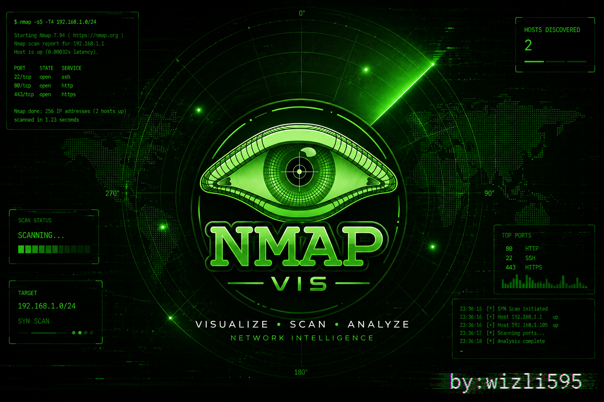

<p align="center">
  
</p>

<p align="center">
  <strong>Visualize. Scan. Analyze.</strong><br>
  A web-based visual interface for Nmap — build commands visually, watch hosts appear on a radar, explore network maps.
</p>

<p align="center">
  
  
  
  
</p>

---

## What is this?

Nmap is powerful but its flags are hard to remember. **nmap-vis** wraps it in a visual web interface where you:

- **Pick scan types and flags** from a visual builder with descriptions for each option
- **Watch a radar sweep** as hosts are discovered in real-time
- **Explore a network map** — click hosts to see open ports, services, and OS details
- **Use presets** — Quick Scan, Intense, Vuln Scan, Stealth, and more with one click
- **Browse NSE scripts** — searchable picker for 20+ common scripts
- **Review history** — every scan is saved to SQLite, revisit results anytime

Two modes: **Docker** (no local nmap needed, some LAN limitations) or **Local** (full power, requires nmap installed). A setup wizard guides you on first launch.

---

## Quick Start

**Prerequisites:** Python 3.12+, Node.js 20+, and either [Docker Desktop](https://www.docker.com/products/docker-desktop/) or [nmap](https://nmap.org/download.html)

```bash
# Clone
git clone https://github.com/wizli595/nmap-vis.git
cd nmap-vis

# Set up the backend
cd backend
python -m venv .venv
source .venv/Scripts/activate   # Windows
# source .venv/bin/activate     # Mac/Linux
pip install -r requirements.txt

# Start backend
uvicorn main:app --reload --port 8001 &

# Set up and start frontend
cd ../frontend
npm install
npm run dev
```

Open **http://localhost:5173** — the setup wizard will guide you through choosing Docker or Local mode and building the nmap image if needed.

---

## Features

### Setup Wizard
First-launch onboarding with two paths: **Docker Mode** (builds Kali+nmap container from the UI with streaming logs) or **Local Mode** (detects your OS, checks for nmap, shows install command). Auto-skips on subsequent visits.

### Visual Scan Builder
Build nmap commands without memorizing flags. Every option has a description. Live command preview shows exactly what will run.

### Radar Visualization
Animated radar sweep during scans. Hosts appear as glowing blips when discovered — sized by port count, with ping ring animations on discovery.

### Network Map
D3 force-directed graph after scan completion. Click any host to see open ports, services, OS, and hostname. Zoom, pan, and drag.

### Scan Presets
| Preset | What it does |
|--------|-------------|
| Quick Scan | `-sS -T4 -F` — top 100 ports, fast |
| Intense | `-sS -T4 -A -v` — OS, version, scripts, traceroute |
| Full Port | `-sS -T4 -p-` — all 65535 ports |
| Vuln Scan | `-sV --script=vuln` — vulnerability detection |
| Stealth | `-sS -T1 -f` — slow, fragmented, IDS evasion |
| Ping Sweep | `-sn -T4` — host discovery only |

### NSE Script Selector
Searchable picker for 20+ Nmap scripts — vuln detection, SSL analysis, service enumeration, brute force, and more.

### Scan History
Every completed scan is saved to SQLite. Browse past scans, click to revisit the network map and terminal output.

---

## Architecture

```
┌─────────────────────────────────────────────┐
│  React + TypeScript + Tailwind              │
│  Radar · Network Map · Flag Picker          │
└──────────────────┬──────────────────────────┘
                   │ REST + WebSocket
┌──────────────────┴──────────────────────────┐
│  FastAPI (Python)                           │
│  routes → services → store                  │
│  Command Builder · XML Parser · Event Bus   │
└──────────────────┬──────────────────────────┘
                   │ Docker subprocess
┌──────────────────┴──────────────────────────┐
│  Kali Linux Container                       │
│  nmap 7.99                                  │
└─────────────────────────────────────────────┘
```

**Design patterns:**
- **Service Layer** — routes are thin, services do the work
- **Fluent Builder** — command construction with input validation
- **Event Bus** — asyncio pub/sub for real-time streaming
- **Schema-Driven Forms** — add a flag by editing a config file, not React code
- **Snapshot + Delta** — WebSocket sends full state on connect, then live updates

---

## Development

```bash
make dev-backend     # FastAPI on :8001
make dev-frontend    # Vite on :5173
make test            # pytest (70+ tests)
make docker-build    # Build nmap container
```

### Adding an Nmap Flag

1. Add entry to `backend/data/flags.json`
2. Add entry to `frontend/src/data/flags.ts` with a `toFlag()` function
3. Done — the UI picks it up automatically

### Adding an NSE Script

1. Add entry to `backend/data/scripts.json`
2. Done — the API serves it, the UI renders it

---

## Tech Stack

| Layer | Tech |
|-------|------|
| Frontend | React 19, TypeScript, Tailwind CSS, Vite, Zustand, D3.js |
| Backend | FastAPI, Pydantic, Uvicorn, SQLite |
| Scanner | Nmap 7.99 in Kali Linux Docker container |
| Visualization | Canvas (radar), SVG/D3 (network map) |

---

## License

MIT

---

<p align="center">
  Built by <a href="https://github.com/wizli595">wizli595</a>
</p>
